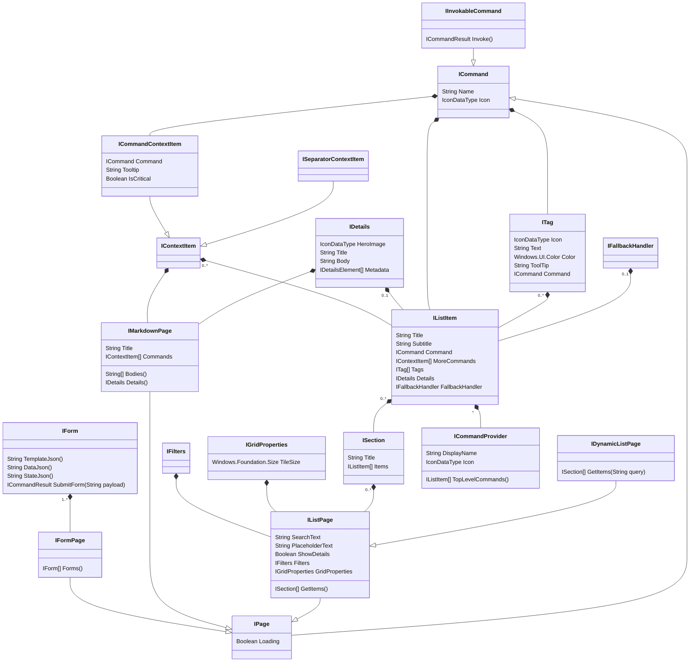

```mermaid
classDiagram
    class ICommand {
        String Name
        IconDataType Icon
    }
    IPage --|> ICommand
    class IPage  {
        Boolean Loading
    }

    IInvokableCommand --|> ICommand
    class IInvokableCommand  {
        ICommandResult Invoke()
    }

    class IForm {
        String TemplateJson()
        String DataJson()
        String StateJson()
        ICommandResult SubmitForm(String payload)
    }
    IFormPage --|> IPage
    class IFormPage  {
        IForm[] Forms()
    }
    IForm "1..*" *-- IFormPage

    IMarkdownPage --|> IPage
    class IMarkdownPage  {
        String Title
        String[] Bodies()
        IDetails Details()
        IContextItem[] Commands
    }
    %% IMarkdownPage *-- IDetails
    IContextItem *-- IMarkdownPage
    IDetails *-- IMarkdownPage
    %%%%%%%%%

    %% class IFilterItem

    %% ISeparatorFilterItem --|> IFilterItem
    %% class ISeparatorFilterItem

    %% IFilter --|> IFilterItem
    %% class IFilter  {
    %%     String Id
    %%     String Name
    %%     IconDataType Icon
    %% }

    %% class IFilters {
    %%     String CurrentFilterId
    %%     IFilterItem[] AvailableFilters()
    %% }
    %% IFilterItem "*" *-- IFilters

    %% class IFallbackHandler {
    %%     void UpdateQuery(String query)
    %% }


    %% IListItem --|> INotifyPropChanged
    class IListItem  {
        String Title
        String Subtitle
        ICommand Command
        IContextItem[] MoreCommands
        ITag[] Tags
        IDetails Details
        IFallbackHandler FallbackHandler
    }
    IContextItem "0..*" *-- IListItem
    IDetails "0..1" *-- IListItem
    ICommand *-- IListItem
    ITag "0..*" *-- IListItem
    IFallbackHandler "0..1" *-- IListItem

    class ISection {
        String Title
        IListItem[] Items
    }
    IListItem "0..*" *-- ISection

    class IGridProperties  {
        Windows.Foundation.Size TileSize
    }

    IListPage --|> IPage
    class IListPage  {
        String SearchText
        String PlaceholderText
        Boolean ShowDetails
        IFilters Filters
        IGridProperties GridProperties

        ISection[] GetItems()
    }
    IFilters *-- IListPage
    IGridProperties *-- IListPage
    ISection "0..*" *-- IListPage

    IDynamicListPage --|> IListPage
    class IDynamicListPage  {
        ISection[] GetItems(String query)
    }

    %% IContextItem --|> INotifyPropChanged


    %%%%%%%%%%%


    class IDetails {
        IconDataType HeroImage
        String Title
        String Body
        IDetailsElement[] Metadata
    }

    class ITag {
        IconDataType Icon
        String Text
        Windows.UI.Color Color
        String ToolTip
        ICommand Command
    }
    ICommand *-- ITag

    %%%%%%
    class IContextItem

    ICommandContextItem --|> IContextItem
    class ICommandContextItem  {
        ICommand Command
        String Tooltip
        Boolean IsCritical
    }
    ICommand *-- ICommandContextItem

    ISeparatorContextItem --|> IContextItem
    class ISeparatorContextItem


    class ICommandProvider {
        String DisplayName
        IconDataType Icon

        IListItem[] TopLevelCommands()
    }
    IListItem "*" *-- ICommandProvider
```
