```csharp
interface IFallbackHandler {
    void UpdateQuery(String query);
}

[uuid("c78b9851-e76b-43ee-8f76-da5ba14e69a4")]
interface IContextItem {}

interface ICommandContextItem requires IContextItem {
    ICommand Command { get; };
    String Tooltip { get; };
    Boolean IsCritical { get; }; // todo: better name for "make this red"

    // TODO-future: we should allow app developers to specify a default keybinding for each of these actions
}
[uuid("924a87fc-32fe-4471-9156-84b3b30275a6")]
interface ISeparatorContextItem requires IContextItem {}

interface IListItem requires INotifyPropChanged {
    String Title{ get; };
    String Subtitle{ get; };
    ICommand Command{ get; };
    IContextItem[] MoreCommands{ get; };  // TODO: name should be better
    ITag[] Tags{ get; };
    IDetails Details{ get; };
    IFallbackHandler FallbackHandler{ get; };
}

interface ISection {
    String Title { get; };
    IListItem[] Items { get; };
}

interface IGridProperties  {
    Windows.Foundation.Size TileSize { get; };
}

interface IListPage requires IPage {
    String SearchText { get; };
    String PlaceholderText { get; };
    Boolean ShowDetails{ get; };
    IFilters Filters { get; };
    IGridProperties GridProperties { get; };

    ISection[] GetItems(); // DevPal will be responsible for filtering the list of items
}

interface IDynamicListPage requires IListPage {
    ISection[] GetItems(String query); // DevPal will do no filtering of these items
}
```

```mermaid
classDiagram

    class ICommand {
        String Name
        IconDataType Icon
    }
    IPage <|-- ICommand
    class IPage  {
        Boolean Loading
    }

    %%%%%%%%%

    class IFallbackHandler {
        void UpdateQuery(String query)
    }


    %% IListItem <|-- INotifyPropChanged
    class IListItem  {
        String Title
        String Subtitle
        ICommand Command
        IContextItem[] MoreCommands
        ITag[] Tags
        IDetails Details
        IFallbackHandler FallbackHandler
    }
    IListItem *-- ICommand
    IListItem o-- ITag
    IListItem *-- IDetails
    IListItem *-- IFallbackHandler

    class ISection {
        String Title
        IListItem[] Items
    }
    ISection o-- IListItem

    class IGridProperties  {
        Windows.Foundation.Size TileSize
    }

    IListPage <|-- IPage
    class IListPage  {
        String SearchText
        String PlaceholderText
        Boolean ShowDetails
        IFilters Filters
        IGridProperties GridProperties

        ISection[] GetItems()
    }
    IListPage *-- IFilters
    IListPage *-- IGridProperties
    IListPage o-- ISection

    IDynamicListPage <|-- IListPage
    class IDynamicListPage  {
        ISection[] GetItems(String query)
    }

    %% IContextItem <|-- INotifyPropChanged



    %%%%%%%%%%%


    class IDetails {
        IconDataType HeroImage
        String Title
        String Body
        IDetailsElement[] Metadata
    }

    class ITag {
        IconDataType Icon
        String Text
        Windows.UI.Color Color
        String ToolTip
        ICommand Command
    }
    ITag *-- ICommand

    %%%%%%
    class IContextItem

    ICommandContextItem <|-- IContextItem
    class ICommandContextItem  {
        ICommand Command
        String Tooltip
        Boolean IsCritical
    }
    ICommandContextItem *-- ICommand

    ISeparatorContextItem <|-- IContextItem
    class ISeparatorContextItem
```


